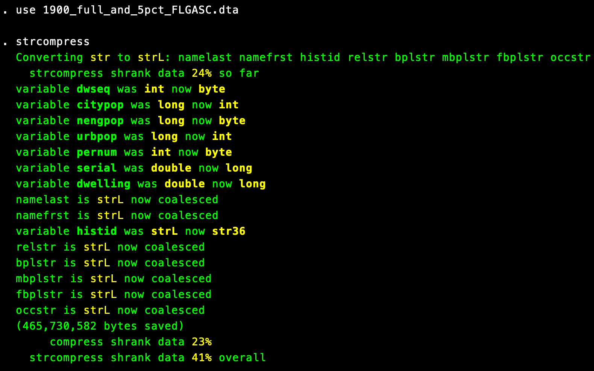

# strcompress: Better compression for Stata string variables
`strcompress` shrinks Stata data files by running `compress` after converting string variables to Stata's "long string" (strL) format.

## Installation
```stata
net install strcompress, from(https://raw.github.com/lukestein/strcompress/master/)
```

## Usage
```stata
strcompress
```

## Notes

`strcompress` can result in significant space savings, especially for large files containing string variables with different-length contents, repeated contents, or many missing values.

For example, `strcompress` shrinks this 2.5gb file containing census data from [IPUMS](https://ipums.org) by 41% (versus 25% running just `compress`):


With an optional varlist, `strcompress` will only attempt strL conversion and compression on the named variables.

Other notes:
1. strL variables *cannot* be used as key variables in merges.
2. strL variables *cannot* be used with the -fillin- command.
3. Running `strcompress` can take a while on large files with large string variables.
4. If you have string variables that take on a reasonable number of distinct values, it may be a good idea to `encode` them before running `strcompress`; you may want to use `unique` (or `gunique`) to identify good candidates for encoding.
5. This code is doing nothing fancy; you can achieve exactly the same results just by running e.g., `recast strL var1 var2 var3` followed by `compress`.
6. To check if there are updates, just run `ado update strcompress`.
7. Inspired by [this Twitter thread](https://twitter.com/lukestein/status/1222263793876492290).
